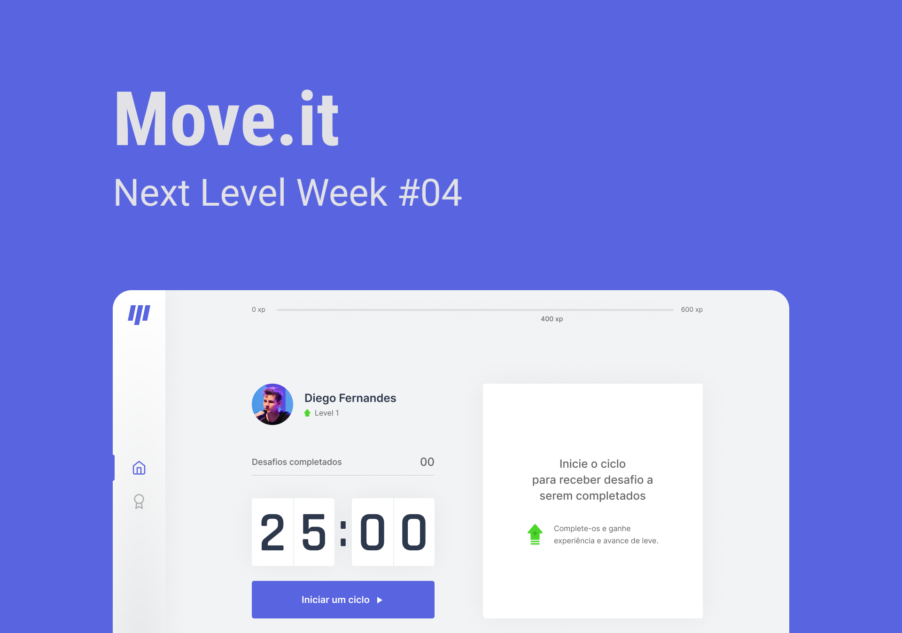

<h1
  align="center"
  style="margin-bottom: 0px;"
>
  Move.it
</h1>
<p
  align="center"
>
  Aplicação feita na trilha de React, na Next Level Week, da Rocketseat.
</p>
<h2
  align="center"
>
    
    
    
</h2>
<hr>



## Index

<hr>

- [Index](#index)
- [Sobre o projeto](#sobre-o-projeto)
- [Tecnologias](#tecnologias)
- [Prints](#prints)
- [Instalação e start](#instalação-e-start)
- [Licença](#licença)
- [Contato](#contato)

## Sobre o projeto

<hr>

Semelhante a técnica Pomodoro, o Move.it gerencia o tempo de suas atividades, bonificando suas conquistas. A cada ciclo de tempo ele vai te dar exercícios simples para você fazer, e caso faça, você ganha uma quantia X de XP. A cada Level que você chega, uma bonificação é dada. O intuito é fazer com que pessoas que trabalhem a maior parte do tempo sentadas, façam algum tipo de exercíco, para não terem problemas com a saúde mais na frente.

## Tecnologias

<hr>

As Tecnologias utilizadas neste projeto foram:

- <a href="https://pt-br.reactjs.org/">React JS</a>
- <a href="https://www.typescriptlang.org/">Typescript</a>
- <a href="https://nextjs.org/">Next.js</a>

## Prints

<hr>


## Instalação e start

<hr>

Certifique-se de que tenha algum gerenciador de dependências em seu ambiente antes de seguir os passos abaixo. Para instalar e iniciar use `npm` ou `yarn`.

### Clonagem

Primeiro, clone o repositório para seu ambiente:

```bash
> git clone https://github.com/jackssonandrey/moveit-nlw04.git
```

Logo em seguinda entre no repositório clonado e rode os seguintes comandos:

#### Web

```bash
# instala todas as dependências
> yarn install

# Starta a aplicação
> yarn dev
```

Será iniciado em `http://localhost:3000`

## Licença

<hr>

O projeto está sobre a licença [MIT](./LICENSE)

## Contato

<hr>


Me siga nas redes sociais, crio conteúdo para o instagram, me segue lá para ver dicas diárias sobre programação e tecnologia.

<p>
  <a href="https://twitter.com/andreydev_">
  
  </a>
  <a href="https://www.linkedin.com/in/jacksson-andrey">
  
  </a>
  <a href="https://www.instagram.com/andreyaraujo.dev/">
  
  </a>
</p>
